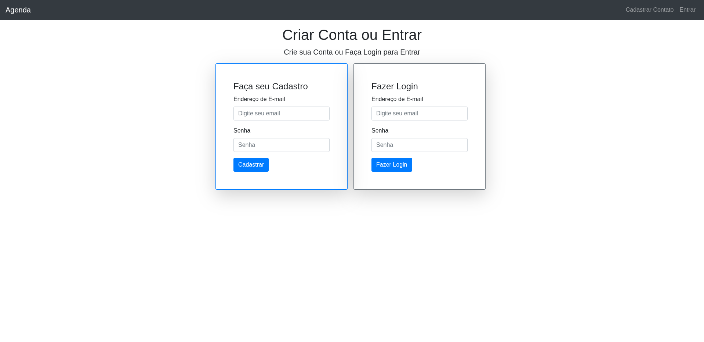
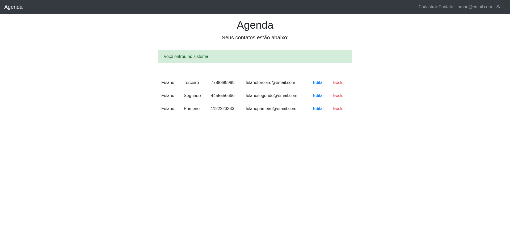
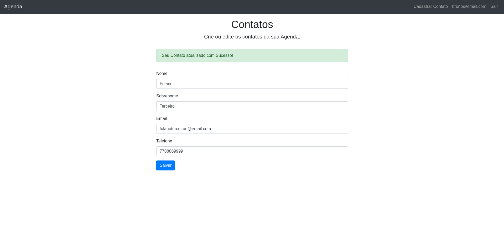
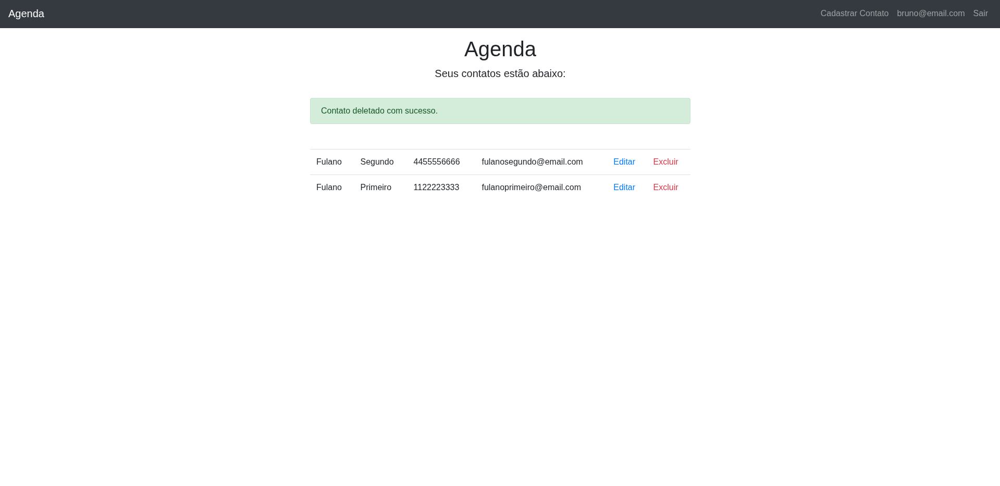

# Projeto API Agenda — API Node + Express (EJS frontend)

## 📸 Screenshots da Aplicação

| Tela de Login | Tela Principal | 
| :-----------: | :------------: | 
|  |  |

| Edição de Usuário | Exclusão de Usuário |
| :------------------: | :------------------: |
|  |  |

## Resumo
- Aplicação web com Node.js + Express + Mangoose que oferece views server-side com EJS e persistência via MongoDB.
- Autenticação por sessão (express-session + connect-mongo) com cookies; CSRF habilitado.
- Senhas tratadas com bcryptjs.
- Assets estáticos servidos em /public.

## Funcionalidades implementadas
- Registro, login e logout (rotas em src/controllers/loginController).
- Rotas protegidas por middleware loginRequired (src/middlewares/middleware).
- CRUD de contatos (src/controllers/contatoController) com views EJS em src/views.
- Proteção CSRF para formulários.
- Mensagens flash (connect-flash).

## Stack
- Node.js + Express
- EJS (views)
- MongoDB + mongoose
- express-session + connect-mongo (sessões)
- csurf (CSRF)
- bcryptjs (hash de senhas)
- helmet (recomendado)
- dotenv, validator, connect-flash

## Estrutura do projeto:
- server.js
- routes.js
- /frontend - arquivos da view
- /src
    - /controllers (homeController, loginController, contatoController)
    - /middlewares (middleware.js)
    - /models
    - /views (EJS)
- /public (assets)

## Rotas principais 
- GET / landing page (homeController.index)

### Rotas de Login
- GET /login/index,
- POST /login/login
- POST /login/register

### Rotas de Logout
- GET /login/logout

### Rotas de Contato
- GET /contato/index -> Mostra todos Contatos  
- POST /contato/register -> Cria um novo Contato
- GET /contato/index/:id -> Busca contato por id
- POST /contato/edit/:id -> Atualiza o contato existente
- GET /contato/delete/:id -> Exclui o contato existente

## Como rodar (rápido)
1. Clone o repositório
2. npm install
3. criar .env com CONNECTIONSTRING e SESSION_SECRET, PORTA já configurada (ex.: PORT=3000)
4. npm start
5. Abrir http://localhost:3000 após a mensagem de conexão com o DB

**Obs: Você deve ter um cluster criado no mangodb **

